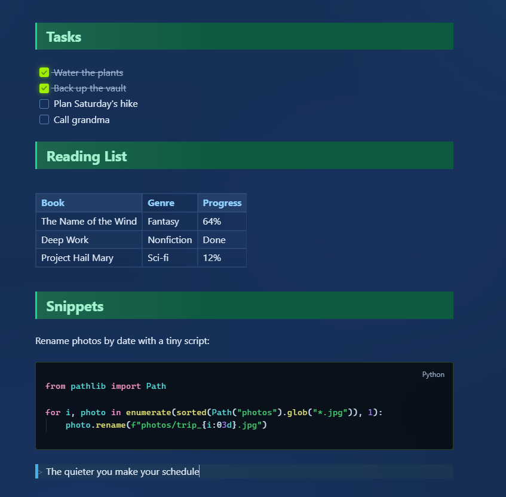
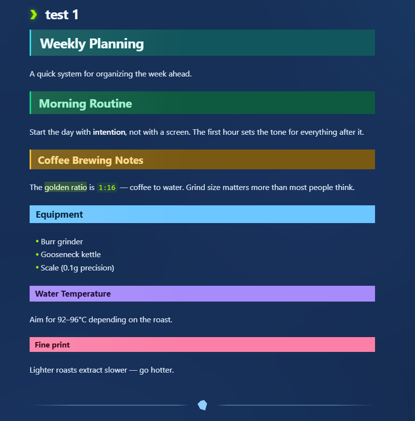
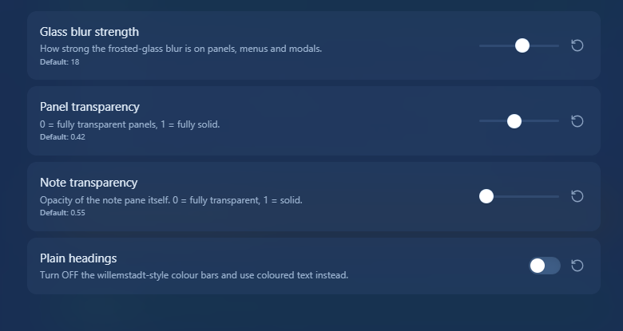

# SAzure Glass

A blue-ish theme for Obsidian inspired by multiple existing themes, namely:
- [Encore](https://publish.obsidian.md/hub/02+-+Community+Expansions/02.05+All+Community+Expansions/Themes/Encore)
- [HackTheBox](https://publish.obsidian.md/hub/02+-+Community+Expansions/02.05+All+Community+Expansions/Themes/Hackthebox)
- [Willemstadt](https://willemstad.cc/Home)

Features:
- Big headings inspired by Willemstadt
- HackTheBox Theme inspired green
- Encore theme inspired blue

## Installation

**From the community themes gallery:** Settings → Appearance → Themes →
Manage → search for **SAzure Glass** → Install and use.

**Manual:** copy `manifest.json` and `theme.css` into
`YourVault/.obsidian/themes/SAzure Glass/`, then select the theme under
Settings → Appearance.

## Credits

- Heading bars and callout styling inspired by the look of the [Willemstadt](https://willemstad.cc/Home) theme
- The note pane's navy-and-neon palette is a nod to the [Hack The Box](https://publish.obsidian.md/hub/02+-+Community+Expansions/02.05+All+Community+Expansions/Themes/Hackthebox) colors. This theme is not affiliated with or endorsed by Hack The Box.
- The blue-ish colors were inspired by the [Encore](https://publish.obsidian.md/hub/02+-+Community+Expansions/02.05+All+Community+Expansions/Themes/Encore) theme

### Recommended settings

## License

MIT — see [LICENSE](LICENSE)
